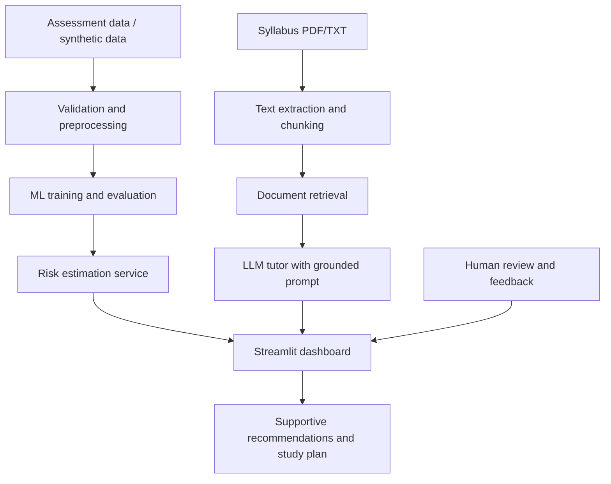

# Proposed System Architecture

## Components

1. **Data layer:** Synthetic or appropriately authorized academic records.
2. **Preprocessing:** Data validation, missing-value handling, and feature preparation.
3. **ML layer:** Baseline classifiers, evaluation, and saved model artifact.
4. **Prediction layer:** Accepts validated input and returns an estimated risk probability.
5. **Knowledge layer:** Extracts and chunks approved syllabus materials and retrieves relevant passages.
6. **Tutor layer:** Uses retrieved context to produce study explanations and plans; indicates when evidence is insufficient.
7. **UI layer:** Streamlit interface for predictions, dataset overview, and tutoring.

## Data Flow
Assessment data is validated and passed to the trained model. The dashboard displays the estimate with limitations and supportive actions. Separately, course documents are indexed for retrieval; student questions retrieve relevant passages that are supplied to the tutor. Human review remains part of the academic support process.
